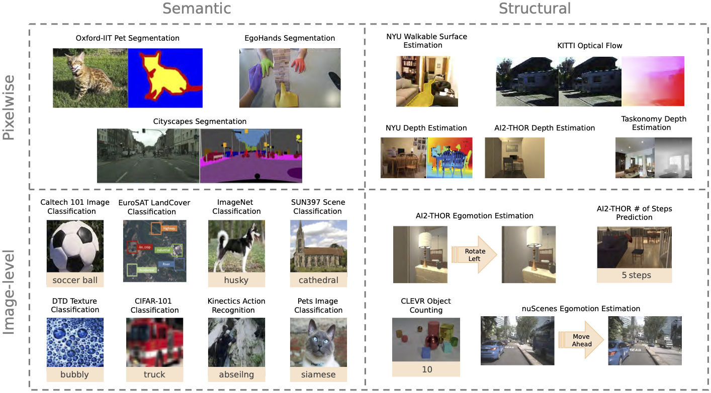
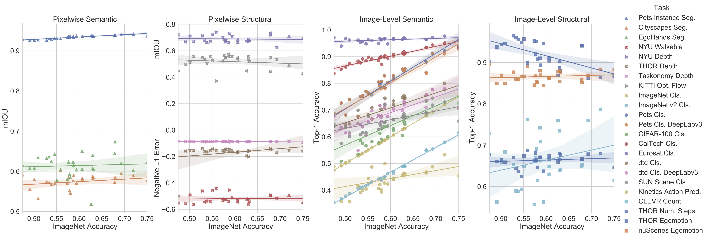

# ViRB

ViRB is a framework for evaluating the quality of representations 
learned by visual encoders on a variety of downstream tasks. It is the 
codebase used by the paper [Contrasting Contrastive Self-Supervised 
Representation Learning Models](https://arxiv.org/pdf/2103.14005.pdf).
As this is a tool for evaluating the learned representations, it is 
designed to freeze the encoder weights and only train a small end task
network using latent representations on the train set for each
task and evaluate it on the test set for that task. To speed this process 
up, the train and test set are pre encoded for most of the end tasks and 
stored in GPU memory for efficient usage. Fine tuning the encoder is also 
supported but takes significantly more time.
ViRB is fully implemented in pyTorch and automatically scales to as many 
GPUs as are available on your machine. It has support for evaluating 
any pyTorch model architecture on a select subset of tasks.

## Installation

To install the codebase simply clone this repository from github and run setup:
```shell script
git clone https://github.com/klemenkotar/ViRB
cd ViRB
pip install -r requirements.txt
```

## Quick Start

For a quick starting example we will train an end task network on the simple
CalTech classification task using the SWAV 800 encoder.

First we need to download the encoder:
```shell script
mkdir pretrained_weights
wget https://prior-model-weights.s3.us-east-2.amazonaws.com/contrastive_encoders/SWAV_800.pt 
mv SWAV_800.pt pretrained_weights/
```

Then we need to download the CalTech dataset from [here](http://www.vision.caltech.edu/Image_Datasets/Caltech101/).
After extracting it you should have a directory named `101_ObjectCategories`. Rename it to `data/caltech/`.


Now we are ready to start the training run with the following command:
```shell script
python main.py --experiment_list=configs/experiment_lists/swav.yaml --virb_configs=configs/virb_configs/caltech.yaml
```

The codebase will automatically use a GPU if one is available on the machine.
The progress will be printed on the screen along with an ETA for completion.

Live tensorboard logs can be acessed by running the following command:
```shell script
tensorboard --logdir=out
```

Once the training is complete the task head model and results json file will be stored in the `out/` directory.

## Dataset Download

To run the full suit of end tasks we need to download all the associated 
datasets. All the datasets should be stored in a folder called `data/`
inside the root project directory. Bellow is a table of links where the data can 
be downloaded and the names of directories they should be placed in. 

Due to the complex nature and diversity of dataset licensing we provide
4 types of links: `Data` which is a direct link to a compressed file that can be downloaded
from the internet, `Website` which is a link to a website where some instructions can be
followed to download the data in question, `JSON` which is a link to a supplementary JSON
file which adds some metadata on top of another existing dataset and `txt` which contain lists
of resources that need to be downloaded.

| Dataset Name  | Dataset Size | Directory | Download Link| Size | Note |
|---------------|--------------|-----------|--------------|------|------|
 ImageNet Cls. | 1,281,167 | data/imagenet/ | [Website](http://www.image-net.org/download) | 126.2 GB 
 Pets Cls. | 3,680  |data/pets/| [Data](https://www.robots.ox.ac.uk/~vgg/data/pets/data/images.tar.gz) | 0.82 GB 
 CalTech Cls. |  3,060  |data/caltech-101/| [Data](http://www.vision.caltech.edu/Image_Datasets/Caltech101/101_ObjectCategories.tar.gz) | 0.14 GB
 CIFAR-100 Cls. |  50,000 |data/cifar-100/| [Data](https://www.cs.toronto.edu/~kriz/cifar-100-python.tar.gz) | 0.19 GB
 SUN Scene Cls. |  87,003 |data/SUN397/| [Data](http://vision.princeton.edu/projects/2010/SUN/SUN397.tar.gz) | 38.0 GB 
 Eurosat Cls. |  21,600 |data/eurosat/| [Data](http://madm.dfki.de/files/sentinel/EuroSAT.zip) | 0.1 GB 
 dtd Cls. |  3,760 |data/dtd/| [Data](https://www.robots.ox.ac.uk/~vgg/data/dtd/download/dtd-r1.0.1.tar.gz) | 0.63 GB 
 Kinetics Action Pred. |50,000 |data/kinetics400/ | [Website](https://github.com/Showmax/kinetics-downloader) | 0.63 GB 
 CLEVR Count | 70,000 |data/CLEVR/| [Data](https://dl.fbaipublicfiles.com/clevr/CLEVR_v1.0.zip) | 20.0 GB 
 THOR Num. Steps | 60,000 |data/thor_num_steps/| [Data](https://prior-datasets.s3.us-east-2.amazonaws.com/ViRB/thor_num_steps.zip)  | 0.66 GB 
 THOR Egomotion | 60,000 |data/thor_action_prediction/| [Data](https://prior-datasets.s3.us-east-2.amazonaws.com/ViRB/thor_egomotion.zip)  | 1.3 GB 
 nuScenes Egomotion | 28,000 |data/nuScenes/| [Website](https://www.nuscenes.org/) [JSON](https://prior-datasets.s3.us-east-2.amazonaws.com/ViRB/nuScenes_train.json) [JSON](https://prior-datasets.s3.us-east-2.amazonaws.com/ViRB/nuScenes_test.json) | 53.43 GB  | Download samples and sweeps 
 Cityscapes Seg. | 3,475 |data/cityscapes/| [Website](https://www.cityscapes-dataset.com/) | 61.89 GB 
 Pets Instance Seg. | 3,680 |data/pets/| [Data](https://www.robots.ox.ac.uk/~vgg/data/pets/data/images.tar.gz) [Masks](https://www.robots.ox.ac.uk/~vgg/data/pets/data/annotations.tar.gz) | 0.82 GB 
 EgoHands Seg. | 4,800 |data/egohands/|  [Data](http://vision.soic.indiana.edu/egohands_files/egohands_data.zip) | 1.35 GB 
 THOR Depth | 60,000 |data/thor_depth_prediction/| [Data](https://prior-datasets.s3.us-east-2.amazonaws.com/ViRB/thor_depth.zip) | 0.25 GB 
 Taskonomy Depth | 39,995 |data/taskonomy/| [Link](http://taskonomy.stanford.edu/) [txt](https://prior-datasets.s3.us-east-2.amazonaws.com/ViRB/taskonomy_scenes.txt) | 48.09 GB | Download the rgb and depth_zbuffer data for the scenes listed in txt
 NYU Depth | 1,159 |data/nyu/| [Data](https://prior-datasets.s3.us-east-2.amazonaws.com/ViRB/nyu.zip) | 5.62 GB | Same data as NYU Walkable
 NYU Walkable | 1,159  |data/nyu/| [Data](https://prior-datasets.s3.us-east-2.amazonaws.com/ViRB/nyu.zip) | 5.62 GB | Same data as NYU Walkable
 KITTI Opt. Flow | 200 |data/KITTI/| [Data](http://www.cvlibs.net/download.php?file=data_scene_flow.zip) | 1.68 GB | 

## Pre-trained Models

As part of our paper we trained several new encoders using a combination of training 
algorithms and datasets. Bellow is a table containing the download links to the weights.
The weights are stored in standard pyTorch format. To work with this codebase, 
the models should be downloaded into a directory called `pretrained_weights/` inside the
root project directory.


| Encoder Name | Method | Dataset | Dataset Size | Number of Epochs | Link | 
|--------------|--------|---------|--------------|------------------|------|
|SwAV ImageNet 100 | SwAV | ImageNet | 1.3M | 100 | [Link](https://prior-model-weights.s3.us-east-2.amazonaws.com/contrastive_encoders/SWAV_100.pt)|
|SwAV ImageNet 50 | SwAV | ImageNet | 1.3M | 50 | [Link](https://prior-model-weights.s3.us-east-2.amazonaws.com/contrastive_encoders/SWAV_50.pt)|
|SwAV Half ImageNet 200 | SwAV | ImageNet-1/2 | 0.5M | 200 | [Link](https://prior-model-weights.s3.us-east-2.amazonaws.com/contrastive_encoders/SWAVHalfImagenet.pt)|
|SwAV Half ImageNet 100 | SwAV | ImageNet-1/2 | 0.5M | 100 | [Link](https://prior-model-weights.s3.us-east-2.amazonaws.com/contrastive_encoders/SWAVHalfImagenet_100.pt)|
|SwAV Quarter ImageNet 200 | SwAV | ImageNet-1/4 | 0.25M | 200 | [Link](https://prior-model-weights.s3.us-east-2.amazonaws.com/contrastive_encoders/SWAVQuarterImagenet.pt)|
|SwAV Linear Unbalanced ImageNet 200 | SwAV | ImageNet-1/2-Lin | 0.5M | 200 | [Link](https://prior-model-weights.s3.us-east-2.amazonaws.com/contrastive_encoders/SWAVUnbalancedImagenet.pt)|
|SwAV Linear Unbalanced ImageNet 100 | SwAV | ImageNet-1/2-Lin | 0.5M | 100 | [Link](https://prior-model-weights.s3.us-east-2.amazonaws.com/contrastive_encoders/SWAVUnbalancedImagenet_100.pt)|
|SwAV Log Unbalanced ImageNet 200 | SwAV | ImageNet-1/4-Log | 0.25M | 200 | [Link](https://prior-model-weights.s3.us-east-2.amazonaws.com/contrastive_encoders/SWAVLogImagenet.pt)|
|SwAV Places 200 | SwAV | Places | 1.3M | 200 | [Link](https://prior-model-weights.s3.us-east-2.amazonaws.com/contrastive_encoders/SWAVPlaces.pt)|
|SwAV Kinetics 200 | SwAV | Kinetics | 1.3M | 200 | [Link](https://prior-model-weights.s3.us-east-2.amazonaws.com/contrastive_encoders/SWAVKinetics.pt)|
|SwAV Taskonomy 200 | SwAV | Taskonomy | 1.3M | 200 | [Link](https://prior-model-weights.s3.us-east-2.amazonaws.com/contrastive_encoders/SWAVTaskonomy.pt)|
|SwAV Combination 200 | SwAV | Combination | 1.3M | 200 | [Link](https://prior-model-weights.s3.us-east-2.amazonaws.com/contrastive_encoders/SWAVCombination.pt)|
|MoCov2 ImageNet 100 | MoCov2 | ImageNet | 1.3M | Yes|[Link](https://prior-model-weights.s3.us-east-2.amazonaws.com/contrastive_encoders/MoCov2_100.pt)|
|MoCov2 ImageNet 50 | MoCov2 | ImageNet | 1.3M | 50 | [Link](https://prior-model-weights.s3.us-east-2.amazonaws.com/contrastive_encoders/MoCov2_50.pt)|
|MoCov2 Half ImageNet 200 | MoCov2 | ImageNet-1/2 | 0.5M | 200 | [Link](https://prior-model-weights.s3.us-east-2.amazonaws.com/contrastive_encoders/MoCov2HalfImagenet.pt)|
|MoCov2 Half ImageNet 100 | MoCov2 | ImageNet-1/2 | 0.5M | 100 | [Link](https://prior-model-weights.s3.us-east-2.amazonaws.com/contrastive_encoders/MoCov2HalfImagenet_100.pt)|
|MoCov2 Quarter ImageNet 200 | MoCov2 | ImageNet-1/4 | 0.25M | 200 | [Link](https://prior-model-weights.s3.us-east-2.amazonaws.com/contrastive_encoders/MoCov2QuarterImagenet.pt)|
|MoCov2 Linear Unbalanced ImageNet 200 | MoCov2 | ImageNet-1/2-Lin | 0.5M | 200 | [Link](https://prior-model-weights.s3.us-east-2.amazonaws.com/contrastive_encoders/MoCov2UnbalancedImagenet.pt)|
|MoCov2 Linear Unbalanced ImageNet 100 | MoCov2 | ImageNet-1/2-Lin | 0.5M | 100 | [Link](https://prior-model-weights.s3.us-east-2.amazonaws.com/contrastive_encoders/MoCov2UnbalancedImagenet_100.pt)|
|MoCov2 Log Unbalanced ImageNet 200 | MoCov2 | ImageNet-1/4-Log | 0.25M | 200 | [Link](https://prior-model-weights.s3.us-east-2.amazonaws.com/contrastive_encoders/MoCov2LogImagenet.pt)|
|MoCov2 Places 200 | MoCov2 | Places | 1.3M | 200 | [Link](https://prior-model-weights.s3.us-east-2.amazonaws.com/contrastive_encoders/MoCov2Places.pt)|
|MoCov2 Kinetics 200 | MoCov2 | Kinetics | 1.3M | 200 | [Link](https://prior-model-weights.s3.us-east-2.amazonaws.com/contrastive_encoders/MoCov2Kinetics.pt)|
|MoCov2 Taskonomy 200 | MoCov2 | Taskonomy | 1.3M | 200 | [Link](https://prior-model-weights.s3.us-east-2.amazonaws.com/contrastive_encoders/MoCov2Taskonomy.pt)|
|MoCov2 Combination 200 | MoCov2 | Combination | 1.3M | 200 | [Link](https://prior-model-weights.s3.us-east-2.amazonaws.com/contrastive_encoders/MoCov2Combination.pt)|

We also used some models trained by third party authors. Bellow is a table of download links for their models
and the scripts used to convert the weights from their format to ViRB format. All of the conversion scripts 
have the exact same usage: `<SCRIPT_NAME> <DOWNLOADED_WEIGHT_FILE> <DESIRED_VIRB_FORMAT_OUTPUT_PATH>`.

| Encoder Name | Method | Dataset | Dataset Size | Number of Epochs | Link | Conversion Script |
|--------------|--------|---------|--------------|------------------|------|-------------------|
|SwAV ImageNet 800 | SwAV | ImageNet | 1.3M | 800 | [Link](https://dl.fbaipublicfiles.com/deepcluster/swav_800ep_pretrain.pth.tar)| scripts/swav_to_virb.py |
|SwAV ImageNet 200 | SwAV | ImageNet | 1.3M | 200 | [Link](https://dl.fbaipublicfiles.com/deepcluster/swav_200ep_pretrain.pth.tar)| scripts/swav_to_virb.py |
|MoCov1 ImageNet 200 | MoCov1 | ImageNet | 1.3M | 200 | [Link](https://dl.fbaipublicfiles.com/moco/moco_checkpoints/moco_v1_200ep/moco_v1_200ep_pretrain.pth.tar)| scripts/moco_to_virb.py |
|MoCov2 ImageNet 800 | MoCov2 | ImageNet | 1.3M | 800 | [Link](https://dl.fbaipublicfiles.com/moco/moco_checkpoints/moco_v2_800ep/moco_v2_800ep_pretrain.pth.tar)| scripts/moco_to_virb.py |
|MoCov2 ImageNet 200 | MoCov2 | ImageNet | 1.3M | 200 | [Link](https://dl.fbaipublicfiles.com/moco/moco_checkpoints/moco_v2_200ep/moco_v2_200ep_pretrain.pth.tar)| scripts/moco_to_virb.py |
|PIRL ImageNet 800 | PIRL | ImageNet | 1.3M | 800 | [Link](https://dl.fbaipublicfiles.com/vissl/model_zoo/pirl_jigsaw_4node_pirl_jigsaw_4node_resnet_22_07_20.34377f59/model_final_checkpoint_phase799.torch)| scripts/pirl_to_virb.py |

## End Task Training

ViRB supports 20 end task that are classified as `Image-level` or `Pixelwise`
depending on the output modality of the task. Furthermore each task is also 
classified as either semantic or structural. Bellow is an illustration of the space of
our tasks. For further details please see [Contrasting Contrastive Self-Supervised 
Representation Learning Models](https://arxiv.org/pdf/2103.14005.pdf).



After installing the codebase and downloading the datasets and pretrained models we are 
ready to run our experiments. To reproduce every experiment in the paper run:
```shell script
python main.py --experiment_list=configs/experiment_lists/all.yaml --virb_configs=configs/virb_configs/all.yaml
```
`WARNING:` this will take well over 1000 GPU hours to train so we suggest training a 
subset instead. We can see the results of all these training runs summarized in the 
graph bellow.


*Correlation of end task performances with ImageNet classification accuracy.
The plots show the end task performance against the ImageNet top-1 accuracy 
for all end tasks and encoders. Each point represents a different encoder 
trained with different algorithms and datasets. This reveals the lack of a 
strong correlation between the performance on ImageNet classification and 
tasks from other categories.*

To specify which task we want to train we create a virb_config yaml file which defines
the task name and training configuration. The file `configs/virb_configs/all.yaml` 
contains configurations for every task supported by this package so it is a good 
starting point. We can select only a few tasks to train and comment out the other 
configurations.

To specify which weights we want to use we specify an experiment list file. The 
file `configs/experiment_lists/all.yaml` contains all the model weights provided 
by this repository. We can select only a few models to train and comment out the other 
configurations. Alternatively we can add in new weights and add them to the list. 
All we have to do is make sure the weights are for a ResNet50 model stored in the 
standard pyTorch weight file.

### Training a SWAV Encoder on the ImageNet End Task

To train a model using the SWAV encoder on the ImageNet classification end task download the ImageNet dataset
from the link in the Dataset Download table above, and the SWAV Imagenet 800 model from the Pretrained-Models
table above. 

Then create a new file inside `configs/virb_configs/` that contains just the ImageNet configuration:
```yaml
Imagenet:
 task: "Imagenet"
 training_configs:
   adam-0.0001:
     optimizer: "adam"
     lr: 0.0001
 num_epochs: 100
 batch_size: 32
```

Then create a new file inside `configs/experiment_lists/` that contains just the SWAV model:
```yaml
SWAV_800: 'pretrained_weights/SWAV_800.pt'
```

 Now run this configuration with the following command:
```shell script
python main.py --experiment_list=configs/experiment_lists/EXPERIMENT_LIST_FILE_NAME.yaml --virb_configs=configs/virb_configs/VIRB_CONFIG_FILE_NAME.yaml
```


### Hyperparameter Search
One feature offered by this codebase is the ability to train the end task networks using
several sets of optimizers, schedulers and hyperparameters. For the Image-level tasks 
(which are encodable), the dataset will get encoded only once and then a model using 
each set of hyperparameters will get trained (to improve efficiency). 

An example of a grid search configuration can be found in 
`configs/virb_configs/imagenet_grid_search.yaml`, and it looks like this:
```yaml
Imagenet:
 task: "Imagenet"
 training_configs:
   adam-0.0001:
     optimizer: "adam"
     lr: 0.0001
   adam-0.001:
     optimizer: "adam"
     lr: 0.001
   sgd-0.01-StepLR:
     optimizer: "sgd"
     lr: 0.01
     scheduler:
       type: "StepLR"
       step_size: 50
       gamma: 0.1
   sgd-0.01-OneCycle:
     optimizer: "sgd"
     lr: 0.01
     scheduler:
       type: "OneCycle"
   sgd-0.01-Poly:
     optimizer: "sgd"
     lr: 0.001
     scheduler:
       type: "Poly"
       exponent: 0.9
 num_epochs: 100
 batch_size: 32
```
We spoecify each training config as a YAML object. The `"sgd"` and `"adam"` optimizers 
are supported as well as the `"StepLR"`, `"OneCycle"` and `"Poly"` schedulers from 
pyTorch's `optim` package. All schedulers are compatible with all of the optimizers.

To execute this ImageNet grid search run:
```shell script
python main.py --experiment_list=configs/experiment_lists/swav.yaml --virb_configs=configs/virb_configs/imagenet_grid_search.yaml
```

### Testing Only Datasets

One aditional feature this codebase supports is datasets that are "eval only" and use
a task head trained on a different task. The only currently supported example is 
ImageNet v2. To test the SWAV 800 model on ImageNetv2 first train at least one 
ImageNet end task head on SWAV 800 then run the following command:
```shell script
python main.py --experiment_list=configs/experiment_lists/swav.yaml --virb_configs=configs/virb_configs/imagenetv2.yaml
```

## Custom Models

All the encoders in the tutorials thus far have used the ResNet50 architecture, but we also 
support using custom encoders. 

All of the Image-level tasks require the encoder outputs a 
dictionary with the key "embedding" mapping to a pyTorch tensor of size `NxD` where `N` is the
batch size and `D` is the arbitrary embedding size. 

All of the Pixelwise tasks require that the encoders output a dictionary with a tensor
for the representation after every block. In practice this means that the model needs to output
5 tensors of sizes corresponding to the outputs of a ResNet50 `conv`, `block1`, `block2`, `block3`
and `block4` layers.

To use a custom model simply modify `main.py` by replacing `ResNet50Encoder` with any encoder with
the outputs mentioned above.

## Citation
```
@article{kotar2021contrasting,
  title={Contrasting Contrastive Self-Supervised Representation Learning Models},
  author={Klemen Kotar and Gabriel Ilharco and Ludwig Schmidt and Kiana Ehsani and Roozbeh Mottaghi},
  journal={arXiv},  
  year={2021},
}
```
